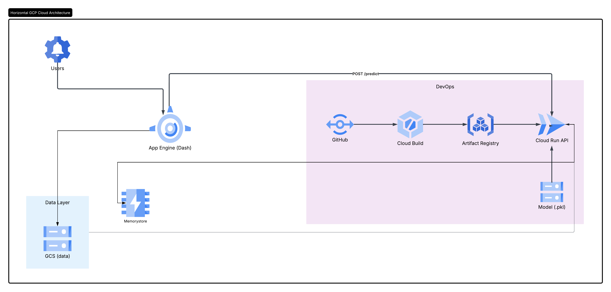

# Criteo Uplift Modeling and Analysis
### CS 163 — Group 3 · Spring 2026

An interactive multi-page web app that measures the **incremental effect of online advertising** on user behavior using the [Criteo Uplift v2.1 dataset](https://ailab.criteo.com/criteo-uplift-modeling-dataset/) (~14M rows). A T-Learner model estimates heterogeneous treatment effects, and a Qini-curve analysis shows that targeting the top 10% of predicted-uplift users captures ~50% of total incremental conversions.

**Live App →** https://cs163-group-3.wl.r.appspot.com  
**Inference API →** https://uplift-api-929926879239.us-west2.run.app/docs#/default/predict_predict_post

---

## Table of Contents

1. [Repository Summary](#1-repository-summary)
2. [Setup Instructions](#2-setup-instructions)
3. [End-to-End Pipeline](#3-end-to-end-pipeline)
4. [Repository Structure](#4-repository-structure)
5. [System Design & Scalability](#5-system-design--scalability)
6. [Inference Service](#6-inference-service)
7. [Data in the Cloud](#7-data-in-the-cloud)

---

## 1. Repository Summary

This repo contains everything needed to reproduce the analysis and run the deployed application:

- **Dash web app** (`app.py`, `pages/`) — five-page interactive dashboard covering dataset exploration, methodology, EDA, and ML findings
- **ML inference service** (`uplift_service/`) — FastAPI + Docker service deployed on Cloud Run; takes user feature vectors and returns real-time uplift predictions
- **Data pipeline** (`data_store.py`, `precomputed/`) — loads the Criteo Parquet file and pre-aggregated CSVs from Google Cloud Storage at startup
- **Infrastructure config** (`app.yaml`, `Dockerfile`, `uplift_service/Dockerfile`) — Google App Engine and Cloud Run deployment definitions

---

## 2. Setup Instructions

**Prerequisites:** Python 3.10+, [Google Cloud SDK](https://cloud.google.com/sdk/docs/install), a GCS bucket with the data files uploaded.

```bash
# 1. Clone
git clone https://github.com/smz785/CS163-Group3.git
cd CS163-Group3

# 2. Create and activate a virtual environment
python -m venv .venv
source .venv/bin/activate          # macOS / Linux
# .venv\Scripts\activate           # Windows

# 3. Install dependencies
pip install -r requirements.txt

# 4. Authenticate with Google Cloud (local dev only)
gcloud auth application-default login

# 5. Point the app at your GCS bucket
export BUCKET_NAME=group-3-bucket  # macOS / Linux
# set BUCKET_NAME=group-3-bucket   # Windows

# 6. Run locally
python app.py
# Open http://127.0.0.1:8050
```

> On Google App Engine the service account authenticates automatically — no key file needed.

---

## 3. End-to-End Pipeline

```
1. Data Collection
   └── Criteo Uplift v2.1 CSV (~3.5 GB, 14M rows) downloaded from the Criteo AI Lab

2. Preprocessing (one-time, run locally)
   └── CSV → Parquet (5–10x faster load, ~300–500 MB)
       └── Uploaded to GCS bucket: gs://group-3-bucket/criteo-uplift-v2.1.parquet

3. Model Training (offline, run locally)
   ├── T-Learner: two HistGradientBoostingClassifier models
   │   ├── model_treated.pkl  — trained on treated users
   │   └── model_control.pkl  — trained on control users
   ├── Uplift score = P(convert | treated) − P(convert | control)
   └── Artifacts exported to uplift_service/models/

4. Precomputed Analysis Outputs (offline, run locally)
   ├── Decile uplift table, Qini curve, policy comparison table, rate summaries
   └── Uploaded to GCS bucket: gs://group-3-bucket/precomputed/*.csv

5. Deployment
   ├── Web app  → gcloud app deploy app.yaml   (App Engine F4_1G)
   └── API      → Cloud Build CI/CD triggered by push to main
                   GitHub → Cloud Build → Artifact Registry → Cloud Run

6. Runtime
   ├── App Engine loads Parquet + precomputed CSVs from GCS on first request (lru_cache)
   ├── Dashboard pages render charts from in-memory DataFrames
   └── "Findings" page calls the Cloud Run /predict endpoint for live inference
```

---

## 4. Repository Structure

```
CS163-Group3/
│
├── app.py                  # Dash app entry point — layout, nav, server object
├── data_store.py           # GCS data loaders (lru_cache); fallback to local files
├── app.yaml                # App Engine config (instance class, scaling, env vars)
├── Dockerfile              # Container definition for the Dash web app
├── requirements.txt        # Web app Python dependencies
├── .dockerignore           # Files excluded from the web app Docker image
├── .gcloudignore           # Files excluded from App Engine deploy
│
├── pages/                  # One file per dashboard page (Dash multi-page routing)
│   ├── home.py             # Overview: motivation and key findings
│   ├── dataset.py          # Dataset schema, size, class imbalance
│   ├── methods.py          # T-Learner, Qini coefficient, policy evaluation
│   ├── EDA.py              # Live EDA charts: funnel, lift, heatmap, PCA
│   └── preliminary_results.py  # ML results: decile uplift, Qini curve, policy table
│
├── training/               # Offline model training scripts (run once locally)
│   └── train_tlearner.py   # Trains T-Learner on GCS Parquet; saves .pkl to uplift_service/models/
│
├── uplift_service/         # Self-contained ML inference microservice
│   ├── app.py              # FastAPI service — /predict endpoint
│   ├── Dockerfile          # Container for Cloud Run deployment
│   ├── requirements.txt    # API dependencies (fastapi, uvicorn, joblib, scikit-learn)
│   └── models/             # Trained model artifacts (committed to repo)
│       ├── model_treated.pkl
│       ├── model_control.pkl
│       └── feature_cols.pkl
│
├── precomputed/            # Pre-aggregated CSVs (also stored in GCS)
│   ├── decile_table.csv
│   ├── qini_table.csv
│   ├── policy_table.csv
│   ├── visit_rate.csv
│   ├── conversion_rate.csv
│   └── conv_given_visit.csv
│
└── assets/
    └── style.css           # Global Dash styles
```

---

## 5. System Design & Scalability

### Architecture



### How the services are connected

The **website** (App Engine) is the central hub. On startup it pulls the full 14M-row Parquet file and six precomputed CSVs from **Google Cloud Storage** using the `google-cloud-storage` SDK, caching everything in RAM for the lifetime of the instance. Every page in the dashboard reads directly from those in-memory DataFrames — no database queries at request time.

When a user visits the Findings page, the app makes a `POST /predict` HTTP request to the **Cloud Run inference API**, passing 12 user feature values. The API returns an uplift score and segment label that the page renders live. The inference API is completely stateless — the trained model `.pkl` files are baked into its Docker image at build time, so it never needs to reach GCS.

The **CI/CD pipeline** (GitHub → Cloud Build → Artifact Registry → Cloud Run) handles all inference API deployments: any push to `main` automatically builds a new Docker image and redeploys the Cloud Run service with zero manual steps.

| From | To | How |
|---|---|---|
| User browser | App Engine | HTTPS — served by Gunicorn/Flask via Dash |
| App Engine | GCS bucket | `google-cloud-storage` SDK; downloads Parquet + CSVs once per instance lifetime |
| App Engine | Cloud Run API | HTTP `POST /predict` — called when the Findings page renders |
| GitHub `main` | Cloud Run | Push triggers Cloud Build → builds Docker image → pushes to Artifact Registry → redeploys Cloud Run service |

### Scalability

| Concern | Decision | Reason |
|---|---|---|
| 14M-row dataset in RAM | `max_instances: 1` on App Engine | Prevents each replica spinning up its own 3.5 GB copy of the data |
| Cold-start latency | `--timeout 120` in Gunicorn; `lru_cache` | GCS download takes ~10–30s; cache keeps it in RAM for all subsequent requests |
| Instance size | `F4_1G` (3.75 GB RAM) | Parquet + Pandas in-memory footprint requires ~2–3 GB |
| Inference API | Cloud Run (serverless, auto-scales 0→N) | Stateless — model is loaded from `.pkl` files baked into the container image; each container is independent |
| Charts that can't recompute at runtime | Precomputed CSVs in GCS | T-Learner training on 14M rows takes hours; results are pre-aggregated once and served as small CSVs |

---

## 6. Inference Service

**Docker code:** [`uplift_service/Dockerfile`](uplift_service/Dockerfile)  
**Service code:** [`uplift_service/app.py`](uplift_service/app.py)  
**Model training code:** [`training/train_tlearner.py`](training/train_tlearner.py)  
**Model artifacts:** [`uplift_service/models/`](uplift_service/models/)

The inference service is a **FastAPI** application containerized with Docker and deployed on **Google Cloud Run**. The models are trained offline by running `training/train_tlearner.py`, which loads the full Criteo dataset from GCS, fits two `HistGradientBoostingClassifier` models (one on treated users, one on control users), and saves the `.pkl` artifacts to `uplift_service/models/`. Those artifacts are then committed to the repo and baked into the Docker image at build time — the running container loads them once on startup and holds them in memory for all requests.

### Endpoint

```
POST https://uplift-api-929926879239.us-west2.run.app/predict
```

Interactive docs: https://uplift-api-929926879239.us-west2.run.app/docs#/default/predict_predict_post

**Input:** 12 anonymized float features (`f0`–`f11`) matching the Criteo dataset schema.

**Output:**

| Field | Type | Description |
|---|---|---|
| `p_treated` | float | Predicted conversion probability if shown an ad |
| `p_control` | float | Predicted conversion probability without an ad |
| `uplift_score` | float | `p_treated − p_control` |
| `recommend_show_ad` | bool | `true` if uplift > 0 |
| `segment` | string | `Persuadable`, `Sleeping Dog / Do Not Target`, `Lost Cause`, or `Neutral / Low Impact` |

### Examples

**Example 1 — Lost Cause**

```bash
curl -X POST "https://uplift-api-929926879239.us-west2.run.app/predict" \
  -H "Content-Type: application/json" \
  -d '{
    "f0": 25.516106, "f1": 10.059654, "f2": 9.039079,
    "f3": 4.679882,  "f4": 10.280525, "f5": 4.115453,
    "f6": -13.293861,"f7": 4.833815,  "f8": 3.88265,
    "f9": 13.190056, "f10": 5.300375, "f11": -0.168679
  }'
```

```json
{
  "p_treated": 0.081558,
  "p_control": 0.087148,
  "uplift_score": -0.00559,
  "recommend_show_ad": false,
  "segment": "Lost Cause"
}
```

**Example 2 — Sleeping Dog / Do Not Target**

```bash
curl -X POST "https://uplift-api-929926879239.us-west2.run.app/predict" \
  -H "Content-Type: application/json" \
  -d '{
    "f0": 14.8,  "f1": 11.7, "f2": 9.4,
    "f3": 5.2,   "f4": 19.5, "f5": 4.6,
    "f6": -0.8,  "f7": 5.4,  "f8": 4.2,
    "f9": 58.0,  "f10": 6.5, "f11": -0.3
  }'
```

```json
{
  "p_treated": 0.804435,
  "p_control": 0.824758,
  "uplift_score": -0.020324,
  "recommend_show_ad": false,
  "segment": "Sleeping Dog / Do Not Target"
}
```

---

## 7. Data in the Cloud

All persistent data lives in a single **Google Cloud Storage** bucket (`group-3-bucket`, `us-west2`).

| Object | Format | Size | Purpose |
|---|---|---|---|
| `criteo-uplift-v2.1.parquet` | Parquet | ~400 MB | Full 14M-row dataset for live EDA charts |
| `precomputed/visit_rate.csv` | CSV | < 1 KB | Mean visit rate by treatment group |
| `precomputed/conversion_rate.csv` | CSV | < 1 KB | Mean conversion rate by treatment group |
| `precomputed/conv_given_visit.csv` | CSV | < 1 KB | Conversion rate conditioned on visit |
| `precomputed/decile_table.csv` | CSV | ~1 KB | Realized uplift per predicted-uplift decile |
| `precomputed/qini_table.csv` | CSV | ~5 KB | Cumulative incremental conversions vs % targeted |
| `precomputed/policy_table.csv` | CSV | ~1 KB | Treat-all vs uplift-targeting policy comparison |

**How data reaches the app:** `data_store.py` uses the `google-cloud-storage` SDK to stream each file into memory as bytes on first access; `functools.lru_cache` ensures this download runs once per App Engine instance lifetime. The `EDA` page calls `get_df()` (full Parquet) and the `Findings` page calls `get_precomputed()` (small CSVs). No data is written back to GCS at runtime.

**Access control:** The App Engine default service account (`cs163-group-3@appspot.gserviceaccount.com`) is granted `Storage Object Viewer` on the bucket. No public access is enabled.

---

## Tech Stack

| Layer | Technology |
|---|---|
| **Frontend / App** | Plotly Dash |
| **Charting** | Plotly Express, Plotly Graph Objects |
| **Data** | Pandas, PyArrow (Parquet) |
| **ML** | scikit-learn — `HistGradientBoostingClassifier` (T-Learner) |
| **Dimensionality Reduction** | scikit-learn PCA |
| **Cloud Storage** | Google Cloud Storage |
| **Serving** | Gunicorn + Flask (via Dash) |
| **Web App Deployment** | Google App Engine (Standard, Python 3.10) |
| **Inference API** | FastAPI + Uvicorn |
| **Inference Deployment** | Google Cloud Run |
| **CI/CD** | Cloud Build + Artifact Registry |
| **Containerization** | Docker |

---

## Team

**CS 163 — Group 3 · Spring 2026**

| Name | GitHub |
|---|---|
| Syed Zain | [@syedzain](https://github.com/smz785) |
| Ayman | [@ayrabia](https://github.com/ayrabia) |
| Thang | [@thang-cao13](https://github.com/thang-cao13) |
